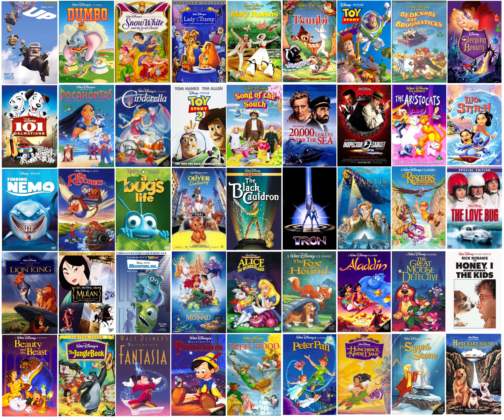

# Disney Movies Data Analysis

Disney is one of those movie companies that has left a huge impact on many people for many years and became a significant part of childhood memories.

The Walt Disney Studios has produced more than 600 great films in so many genres since the debut film Snow White and Seven Dwarf in 1937. Most of them turned into a great success in the box office while some of them did not. In this notebook, I will analyze the impact of some features in the box office success.

## Data

The dataset include all movies produced until 2016.

Data Source: https://www.kaggle.com/prateekmaj21/disney-movies  

Available features:
1. Movie Title
2. Release Date
3. Genre
4. MPAA Rating
5. Total Gross
6. Inflation Adjusted Gross  

